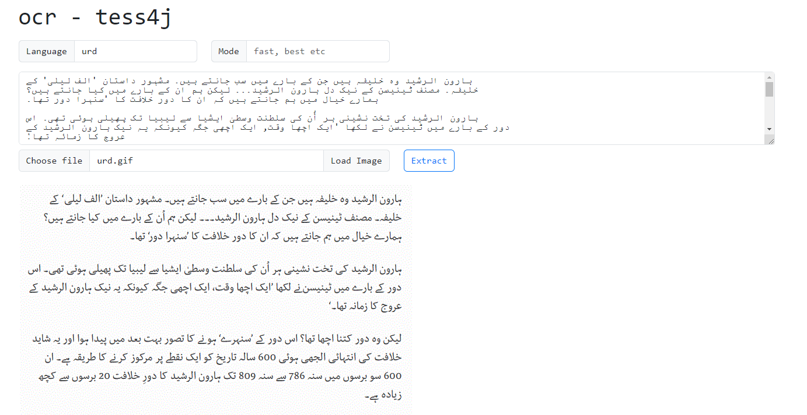

# spring-boot-starter-ocr

Spring Boot starter for optical character recognition from images using Tess4J(A Java JNA wrapper for Tesseract OCR API).

## Requirements

- [Java 21](https://www.oracle.com/java/technologies/downloads/#java21)
- [Maven 3](https://maven.apache.org)
- [Tess4J](https://github.com/nguyenq/tess4j

## Running the application locally

- Execute the `main` method of `io.github.meritepk.webapp.Application` class from IDE

or

- Use [Spring Boot Maven plugin](https://docs.spring.io/spring-boot/docs/current/reference/html/build-tool-plugins-maven-plugin.html) like `mvn spring-boot:run`

or

- Execute after build `java -jar spring-boot-starter-ocr-<version>.jar`

Open [http://localhost:8080/ui/index.html](http://localhost:8080/ui/index.html) in web browser
